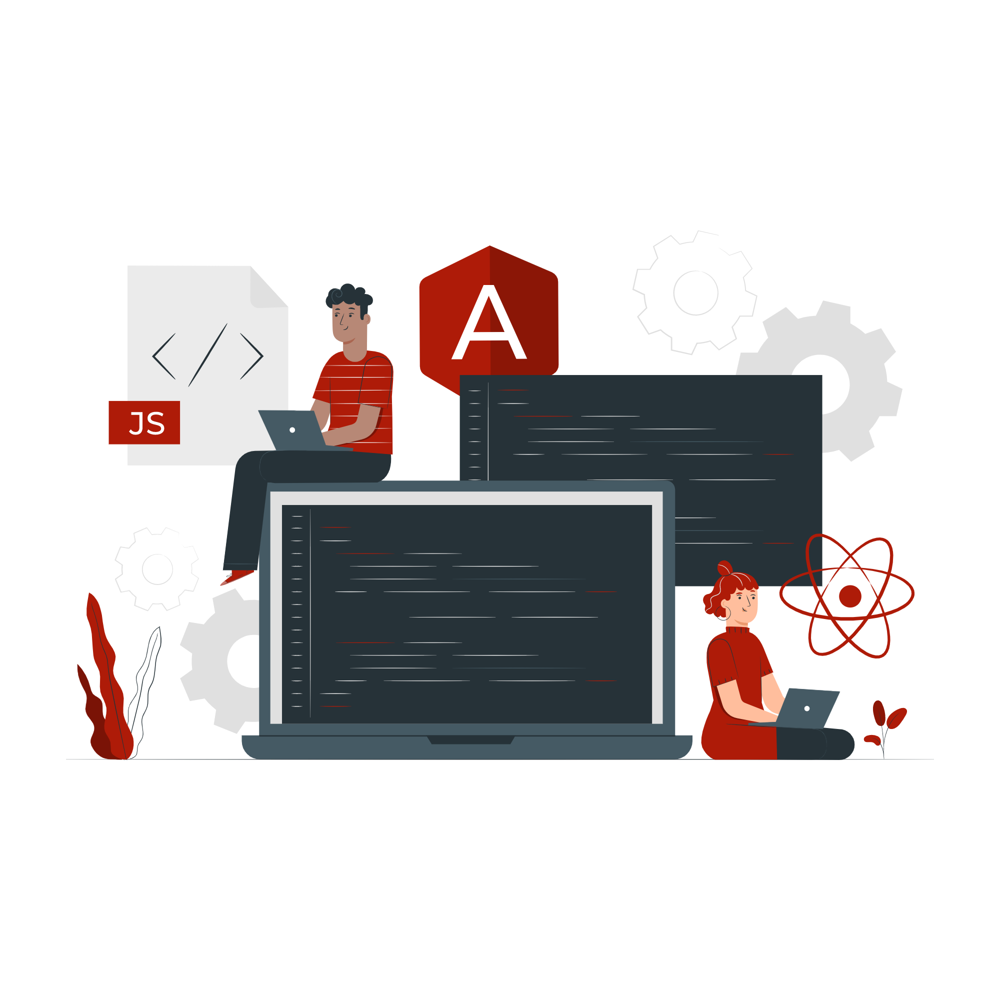

<h1 align="center">Oi, eu sou o Thiago. 😎</h1>
<h2 align="center">Instrutor/Programador Front-End</h2>

     
🔭 Trabalhando atualmente na Generation Brazil como **Tech-Lead Front-End (HTML/CSS/JS/Angular)**

🖥 Linkedin: [Thiago Faccipieri](https://www.linkedin.com/in/thiago-faccipieri/)

📫 Caso queira me mandar um e-mail: **thiago.faccipieri@gmail.com**

     

<h2 align="center">Languages and Tools:</h2>

              

</div
